# ScotAccount Client Architecture Diagram

This diagram illustrates the complete architecture of the ScotAccount client application and its interaction with the ScotAccount services.

## System Overview

The ScotAccount client is a Spring Boot application that acts as an OAuth2/OIDC client, integrating with ScotAccount's authentication and attribute services to provide secure user authentication and verified attribute retrieval.

## Architecture Diagram

```mermaid
graph TB
    %% User Layer
    subgraph "User Layer"
        Browser[User Browser]
    end

    %% Client Application Layer
    subgraph "ScotAccount Client Application"
        subgraph "Controllers"
            HomeController[HomeController]
            LoginController[LoginController]
            LogoutController[LogoutController]
            VerificationController[VerificationController]
        end

        subgraph "Services"
            AttributeService[AttributeService]
            JwtUtil[JwtUtil]
            CustomTokenClient[CustomOAuth2AccessTokenResponseClient]
        end

        subgraph "Security"
            SecurityConfig[SecurityConfig]
            OAuth2Auth[OAuth2AuthenticationToken]
            OAuth2Client[OAuth2AuthorizedClientService]
            JwtDecoder[JwtDecoder]
        end

        subgraph "Configuration"
            ClientReg[ClientRegistrationRepository]
            AuthResolver[OAuth2AuthorizationRequestResolver]
            CsrfRepo[CookieCsrfTokenRepository]
        end

        subgraph "Templates"
            IndexTemplate[index.html]
            ErrorTemplate[error.html]
        end
    end

    %% ScotAccount Services Layer
    subgraph "ScotAccount Services"
        subgraph "Authentication"
            ScotAuth[Authorization Service /authorize]
            ScotToken[Token Service /token]
        end

        subgraph "Identity & Attributes"
            ScotAttr[Attributes Service /attributes/values]
            ScotJWKS[JWKS Service /jwks]
        end

        subgraph "User Management"
            ScotUserInfo[UserInfo Service /userinfo]
        end
    end

    %% External Services
    subgraph "External Services"
        RestTemplate[RestTemplate]
        ObjectMapper[ObjectMapper]
    end

    %% Browser Interactions
    Browser --> HomeController
    Browser --> LoginController
    Browser --> LogoutController
    Browser --> VerificationController

    %% Controller Dependencies
    HomeController --> AttributeService
    HomeController --> OAuth2Client
    LoginController --> OAuth2Client
    LoginController --> JwtDecoder
    VerificationController --> OAuth2Client

    %% Service Dependencies
    AttributeService --> RestTemplate
    AttributeService --> JwtUtil
    AttributeService --> ObjectMapper
    CustomTokenClient --> JwtUtil

    %% Security Dependencies
    SecurityConfig --> ClientReg
    SecurityConfig --> AuthResolver
    SecurityConfig --> CsrfRepo
    SecurityConfig --> CustomTokenClient
    SecurityConfig --> JwtDecoder

    %% ScotAccount Service Calls
    LoginController --> ScotAuth
    CustomTokenClient --> ScotToken
    JwtDecoder --> ScotJWKS
    AttributeService --> ScotAttr

    %% Template Rendering
    HomeController --> IndexTemplate
    HomeController --> ErrorTemplate

    %% OAuth2 Flow
    OAuth2Auth --> OAuth2Client
    OAuth2Client --> ScotToken

    %% Styling
    classDef browserClass fill:#e1f5fe,stroke:#01579b,stroke-width:2px
    classDef clientClass fill:#f3e5f5,stroke:#4a148c,stroke-width:2px
    classDef scotClass fill:#fff3e0,stroke:#e65100,stroke-width:2px
    classDef externalClass fill:#fce4ec,stroke:#880e4f,stroke-width:2px

    class Browser browserClass
    class HomeController,LoginController,LogoutController,VerificationController,AttributeService,JwtUtil,CustomTokenClient,SecurityConfig,OAuth2Auth,OAuth2Client,JwtDecoder,ClientReg,AuthResolver,CsrfRepo,IndexTemplate,ErrorTemplate clientClass
    class RestTemplate,ObjectMapper externalClass
    class ScotAuth,ScotToken,ScotAttr,ScotJWKS,ScotUserInfo scotClass
```

## Component Descriptions

### User Layer

- **Browser**: The user's web browser that interacts with the application

### Client Application Layer

#### Controllers

- **HomeController**: Handles the main application entry point and displays user information
- **LoginController**: Manages OAuth2 login flow and token exchange
- **LogoutController**: Handles user logout and session cleanup
- **VerificationController**: Manages user verification processes

#### Services

- **AttributeService**: Fetches and processes user attributes from ScotAccount
- **JwtUtil**: Handles JWT token creation, validation, and decoding
- **CustomOAuth2AccessTokenResponseClient**: Custom token response handling

#### Security Components

- **SecurityConfig**: Main security configuration with OAuth2 and CSRF settings
- **OAuth2AuthenticationToken**: Represents authenticated OAuth2 users
- **OAuth2AuthorizedClientService**: Manages OAuth2 client sessions
- **JwtDecoder**: Decodes and validates JWT tokens

#### Configuration

- **ClientRegistrationRepository**: Stores OAuth2 client configurations
- **OAuth2AuthorizationRequestResolver**: Handles authorization request resolution with PKCE
- **CookieCsrfTokenRepository**: Manages CSRF token storage

### ScotAccount Services Layer

#### Authentication Services

- **Authorization Service (/authorize)**: Handles user authentication and authorization
- **Token Service (/token)**: Exchanges authorization codes for access tokens

#### Identity & Attributes Services

- **Attributes Service (/attributes/values)**: Provides verified user attributes
- **JWKS Service (/jwks)**: Provides JSON Web Key Set for token validation

#### User Management

- **UserInfo Service (/userinfo)**: Provides basic user information

### External Services

- **RestTemplate**: HTTP client for API calls
- **ObjectMapper**: JSON serialization/deserialization

## Authentication Flow

1. **Initial Request**: Browser requests the application home page
2. **Login Initiation**: User clicks login, triggering OAuth2 authorization request
3. **ScotAccount Authentication**: User is redirected to ScotAccount for authentication
4. **Authorization Code**: ScotAccount returns authorization code to client
5. **Token Exchange**: Client exchanges authorization code for access token
6. **Attribute Retrieval**: Client uses access token to fetch user attributes
7. **User Display**: Application displays user information and verified attributes

## Security Features

- **PKCE (Proof Key for Code Exchange)**: Prevents authorization code interception
- **CSRF Protection**: Cookie-based CSRF token protection
- **JWT Validation**: Token validation using ScotAccount's JWKS
- **Session Management**: Secure session handling with fixation protection
- **Client Assertion**: JWT-based client authentication for API calls

## Key Technologies

- **Spring Boot**: Application framework
- **Spring Security**: Security framework with OAuth2 support
- **OAuth2/OIDC**: Authentication and authorization protocols
- **JWT**: Token-based authentication
- **Thymeleaf**: Template engine for views
- **Maven**: Build and dependency management
