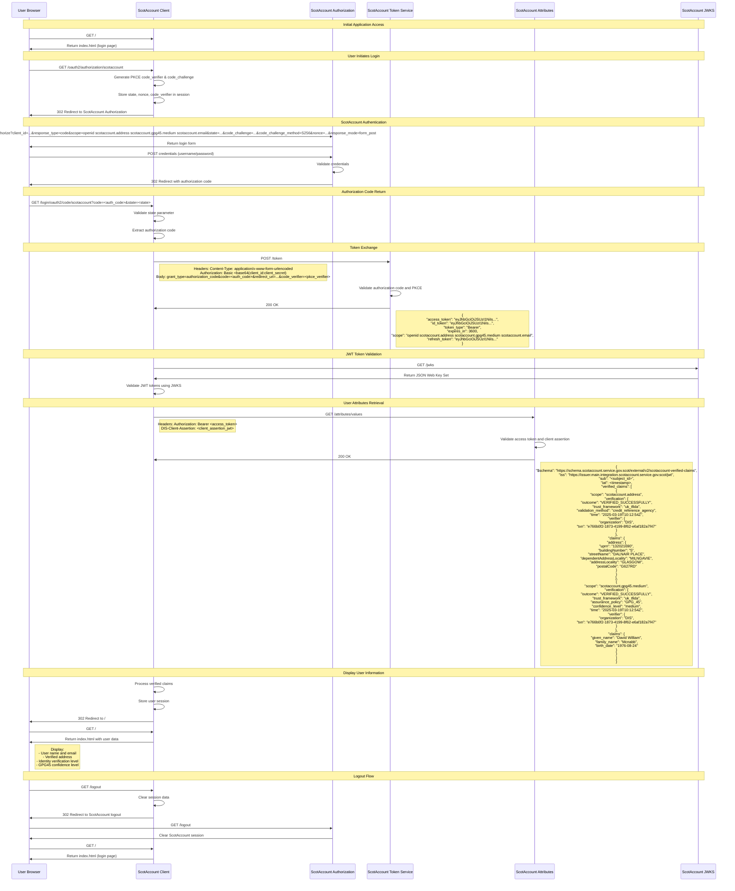

# Browser Interaction Flow with ScotAccount

This diagram shows the detailed interaction flow between the user's browser, the ScotAccount client application, and the ScotAccount services.

## Sequence Flow Diagram

## Key Security Features

### PKCE (Proof Key for Code Exchange)

- **Code Verifier**: Random string generated by client
- **Code Challenge**: SHA256 hash of code verifier
- **Purpose**: Prevents authorization code interception attacks

### JWT Token Validation

- **Access Token**: Bearer token for API access
- **ID Token**: Contains user identity information
- **JWKS**: JSON Web Key Set for token signature validation

### Client Assertion

- **Purpose**: Authenticates the client to ScotAccount APIs
- **Format**: JWT signed with client's private key
- **Claims**: Includes client ID, audience, expiration

### Session Management

- **Session Creation**: IF_REQUIRED policy
- **Session Fixation**: New session on login
- **Maximum Sessions**: 1 per user
- **CSRF Protection**: Cookie-based tokens

## Error Handling

### Authentication Errors

- Invalid credentials → ScotAccount returns 401
- Expired authorization code → Token service returns 400
- Invalid state parameter → Client redirects to error page

### Authorization Errors

- Missing required scopes → Client shows limited information
- Invalid access token → Attributes service returns 401
- Expired access token → Client uses refresh token

### Network Errors

- ScotAccount service unavailable → Client shows error page
- Timeout errors → Retry with exponential backoff
- SSL/TLS errors → Secure connection validation

## Data Flow Summary

1. **Browser Request** → Client processes and redirects to ScotAccount
2. **ScotAccount Authentication** → User provides credentials
3. **Authorization Code** → ScotAccount returns code to client
4. **Token Exchange** → Client exchanges code for access token
5. **Attribute Retrieval** → Client fetches verified user attributes
6. **User Display** → Client renders user information and verified claims
7. **Session Management** → Client maintains secure session state
