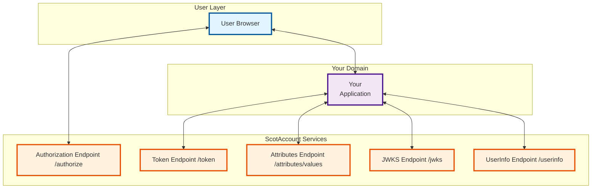
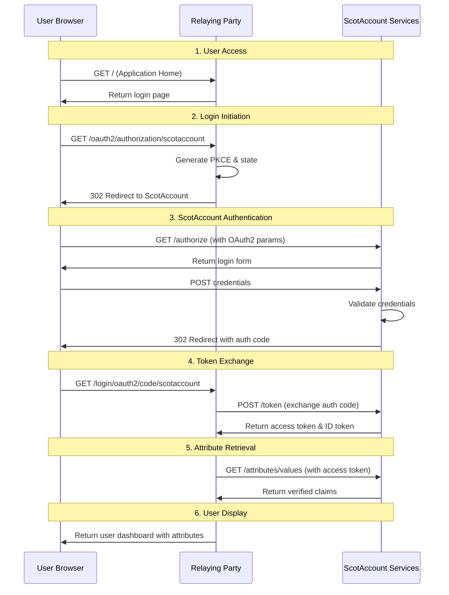

# High-Level ScotAccount Architecture

This diagram shows the high-level architecture focusing on the three main components: the Relaying Party application, ScotAccount endpoints, and the browser interactions.

## High-Level Architecture Diagram

## Component Overview

### User Layer

- **Browser**: The user's web browser that initiates authentication and displays the application

### Relaying Party Application

- **Spring Boot OAuth2 Client**: The ScotAccount client application that acts as a relaying party
- **Responsibilities**:
  - Handles user login requests
  - Manages OAuth2/OIDC flow
  - Processes authentication tokens
  - Fetches and displays user attributes
  - Manages user sessions

### ScotAccount Services

- **Authorization Endpoint (/authorize)**: Handles user authentication and authorization
- **Token Endpoint (/token)**: Exchanges authorization codes for access tokens
- **Attributes Endpoint (/attributes/values)**: Provides verified user attributes and claims
- **JWKS Endpoint (/jwks)**: Provides JSON Web Key Set for token validation
- **UserInfo Endpoint (/userinfo)**: Provides basic user information

## Authentication Flow

## Key Interactions

### 1. **Browser ↔ Relaying Party**

- **Login Requests**: User initiates authentication
- **Session Management**: Browser maintains session cookies
- **User Interface**: Displays login forms and user information

### 2. **Relaying Party ↔ ScotAccount**

- **OAuth2 Flow**: Authorization code grant with PKCE
- **Token Management**: Access token and ID token handling
- **Attribute Fetching**: Retrieval of verified user claims
- **JWT Validation**: Token validation using JWKS

### 3. **Security Features**

- **PKCE**: Prevents authorization code interception
- **JWT Tokens**: Secure token-based authentication
- **Client Assertion**: JWT-based client authentication
- **HTTPS**: All communications over secure channels

## Data Flow Summary

1. **User initiates login** → Browser requests authentication
2. **OAuth2 authorization** → Relaying Party redirects to ScotAccount
3. **User authentication** → ScotAccount validates credentials
4. **Token exchange** → Relaying Party exchanges auth code for tokens
5. **Attribute retrieval** → Relaying Party fetches verified claims
6. **User display** → Relaying Party shows user information

## Benefits of This Architecture

- **Separation of Concerns**: Clear separation between client, identity provider, and user
- **Security**: OAuth2/OIDC standards with PKCE and JWT validation
- **Scalability**: Stateless token-based authentication
- **Compliance**: Follows government identity standards (GPG45)
- **User Experience**: Seamless authentication flow with verified attributes
